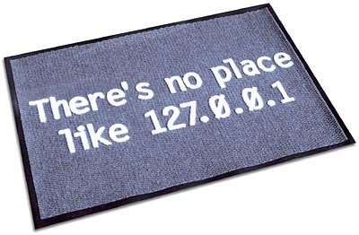
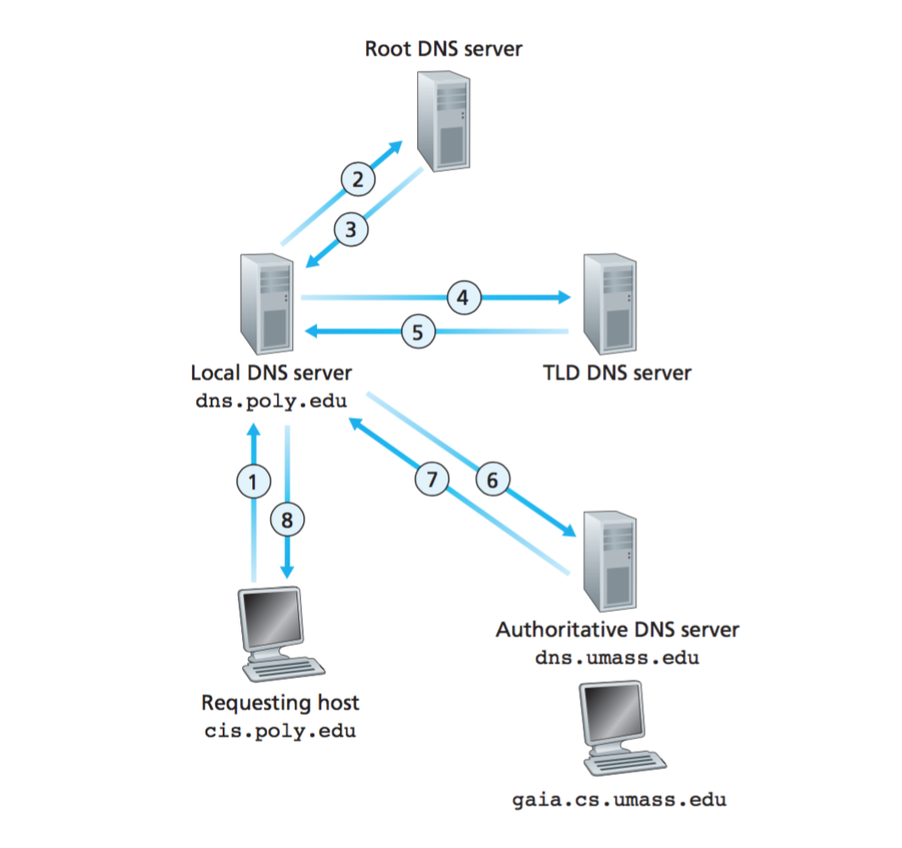
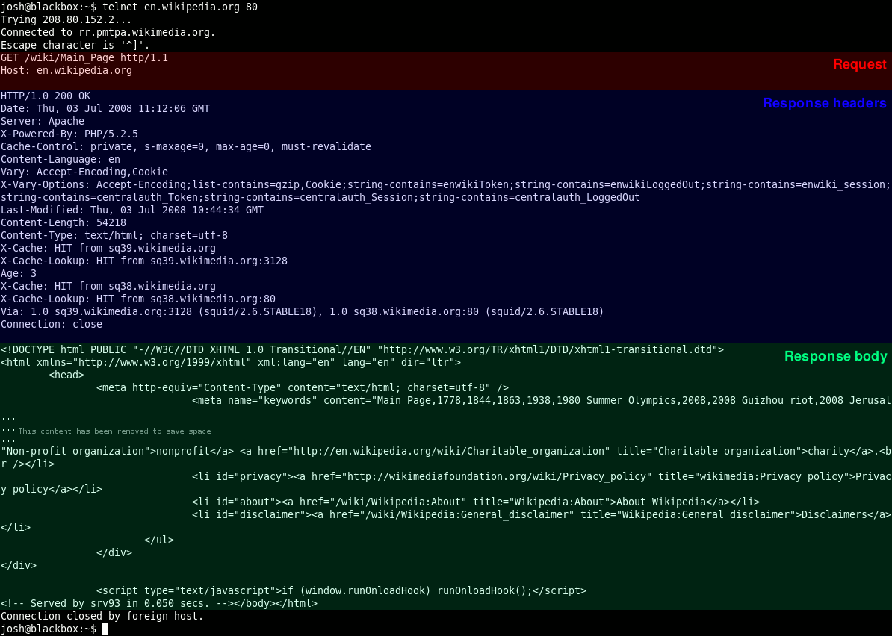

# The INTERWEBS #

"A series of tubes" — [Senator Ted Stevens (R-Alaska)](https://en.wikipedia.org/wiki/Series_of_tubes)

:question: Okay... but tubes?

Well technically perhaps you can think of electrical and optical lines as tubes, but regardless before we can code for the web we should understand what all is involved.

Here is map of the submarine optical cables that provide internet connectivity globally. Note: most internet runs over physical cables, satellite is used only for remote areas and has a very high latency.

{: .fancy }
(from [submarinecablemap.com](http://www.submarinecablemap.com/))

{: .fancy }
(from [Chris Harrison](http://chrisharrison.net/index.php/Visualizations/InternetMap))

{: .fancy }
(from [Paul Butler](https://gigaom.com/2010/12/14/facebook-draws-a-map-of-the-connected-world/))

The FB map is more of a social graph but does show internet connected Facebook users. Notice anything interesting missing?

So how does data traverse this really complicated graph of interconnected of wires?

*We'll cover some basics of networking here but for more in-depth on the subject, take CS60*


## Protocols ##

Computers talk to each other just like humans.  When you have an interaction at a cafe with the barista you are following a social protocol. Protocols are simply the order and format of the conversation and both computer hardware and software employ protocols to communicate.


(image from [Computer Networking: A Top Down Approach](https://wps.pearsoned.com/ecs_kurose_compnetw_6/))

We'll only be focusing on a few protocols but there are many protocols from how to transmit email to how your wifi sends radio signals.

## Layers ##

The internet currently operates using a system of layered protocols.  Your mail program does not need to know about how data gets transmitted between your computer and your wifi router, but both of these things have to work to get the data to your destination.

So the internet is made of layers. Like parfait.

Let's use a better analogy.

### Airline Routing ###

Say you are carrying some important data and you want to get from Boston to SF, most likely you'll want to fly.  There are many layered systems that are involved in getting you to your destination.


(image from [Computer Networking: A Top Down Approach](https://wps.pearsoned.com/ecs_kurose_compnetw_6/) p. 48)

Note how these are layered.  Any given system adds information and provides a service.  So the baggage layer provides the service of transferring baggage for you and gives you a baggage tracking code that you carry with you.

Having a layered system allows us to add/remove/change services without impacting the rest of the stack. You can travel with carry-on for instance and skip the baggage service completely, or you can buy your ticket in different ways.

### Internet Protocol Suite ###

The internet is a complex system and uses a **layered service model** that consists of 5 layers. Each layer performs some actions for the layer above it and utilizes the layer below it.

* :apple: Application Layer:
  This layer includes protocols such as HTTP (web), SMTP(email), DNS(name service), FTP(file transfer protocol).  These are all application level in that they largely pass messages between specific applications.  In the case of HTTP for instance between web browser and a program running on a web server.
* :train2: Transport Layer:
  This layer is responsible for establishing a connection to the correct application on another host and guaranteed delivery of the applications messages. Most of what we will be seeing will be using TCP as the transport layer. TCP uses port numbers to identify applications on the hosts.  TCP only handles the transfer of application data and does not know anything about internet routing. That is for the Network Layer.
* :triangular_flag_on_post: Network Layer
  This layer contains the IP protocol. IP sends and routes packets between hosts. All internet connected devices that have a Network Layer must implement the IP protocol. TCP passes the target destination in the form of the IP address down to this layer which then routes it along the many different hosts on the way to the target.
* :link: Link Layer
  This layer passes data between hosts and includes protocols such as Ethernet and WiFi. Each host along the route talks to another in a particular way and neither your application, nor TCP, nor the network need to know how the specifics.
* :telephone: Physical Layer
  This layer contains protocols for transferring bits along a wire or fiber optic cable. We'll largely ignore this layer.

Note: this [Internet Protocol Stack](https://en.wikipedia.org/wiki/Internet_protocol_suite) is not the only model. You may hear about the 7 layer [OSI model](https://en.wikipedia.org/wiki/OSI_model), however it is currently only a concept and is not implemented.

### Encapsulation and Packets

As data is passed down the layers it is encapsulated with additional layer specific headers. Here is a simplified view of the data packet as it passes down the stack.

{: .small }

### Internet Data Flow

Say we have two computers (referred to as hosts) that need to communicate. For instance your laptop is Host A and Google is Host B. The router is the network hardware that directs (routes) internet traffic, similar to an airline controller. More on routing in a bit, suffice to say for now that routers pass traffic along to the next router toward the destination.


## Addresses ##

:question: But what about addresses?  To travel anywhere you need an address!

The IP protocol deals with addresses. Most of the internet runs on [IPv4](https://en.wikipedia.org/wiki/IPv4) addresses which are 32 bit numbers (4 bytes).  Typically these are written in *dotted decimal notation* and look like  **nnn.nnn.nnn.nnn** where each byte is represented by an integer between 0 and 255.  IPv4 is running out of addresses as the whole space is only 4,294,967,296 (2^32) addresses.  However because of private networks (your laptop right now most likely has a private IP) IPv4 keeps living on.

Some things you should know about IP address.

### Private Addresses, Special Addresses

`10.*.*.*` and `192.168.*.*` addresses are reserved for private networks.  Dartmouth Secure is a `10.` network.

_we can also denote these networks by using significant bits notation:  `10.0.0.0/24` is equivalent to `10.*.*.*` and `192.168.*.*` is `192.168.0.0/16`_

`127.0.0.1` is reserved for your loopback address.  This is an address you can use when running your local dev environment!  `localhost`, `127.0.0.1`, `0.0.0.0` will all work to access the machine you are physically on.

`255.255.255.255` is a broadcast address,  which means it will attempt to connect to every machine on your subnet.  Try this:
`sudo ping -t1 255.255.255.255` in your terminal.  You may get lots of responses, although on Dartmouth Secure you most likely are on a private subnet

These addresses are not publicly routable, meaning that routers across the internet will not know how to direct traffic to them. More about this soon.



Publicly routable addresses are IPs that you can get to from anywhere.  All you really need to know here is that various registrars and countries are responsible for different blocks. Here's a map!


## DNS ##

:question: Ok, but question. I'm seeing all these numbers, but what about domain names? All I want is myname.com!

That is where DNS (Domain Name Service) comes in.  DNS is a protocol for mapping names to IP numbers -- sort of like the yellow pages (😮does anybody even know what that is anymore?) for the internet.  Since IP doesn't understand names another layer comes in to help with this.

What layer in the stack do you think DNS fits into?


Correct! DNS is an Application Layer protocol. DNS servers are organized as a distributed hierarchical database.  Your laptop get assigned a couple of DNS servers whenever it connects to the network (via another application layer protocol DHCP).  These are your local ISPs (internet service provider) DNS servers.

💻  `dig dartmouth.edu`
or
💻  `host dartmouth.edu`

This will do a DNS lookup of that address.

These local servers can't know every name however, so whenever they don't know something they know who to ask next.
1. local name server will ask a ROOT server to find out which TLD (top level domain) server to ask.  TLDs are the various .com, .org, .ly, .website, domains.
2. then local name server will ask the TLD what it knows about that domain name. The TLD will return the authoritative name servers that are set up when you register a domain name.  (we'll do that next class!)
3. then finally the local name server will query the authoritative name server.  Large organizations may run their own DNS servers (CS runs its own as does Dartmouth), but registrars like godaddy(bad) and [namecheap](http://namecheap.com)(good) do as well.



We'll learn more about DNS when we cover deployment and scaleability later.

## Routing ##

:question: Wait ok but back up, how does a packet find its way around all those tubes!?

As a packet travels from one host to another it crosses through a series routers.  Each of these forwards the packet on based on a set of rules.   Routers will have typically have routing tables that tell it where to send packets.

You can think of this as a bit similar to DNS,  packets are forwarded along to routers that should know more about where to send them. Routing algorithms and tables are fairly complicated, for our purposes we'll explore just the basics.

When a router gets a datagram (what we've been calling a packet) it does some logic similar to the following:

```
Given a destination IP address, D, and network prefix, N:

if ( N matches a directly connected network address )

    Deliver datagram to D over that network link;

else if ( The routing table contains a route for N )

    Send datagram to the next-hop address listed in the routing table;

else if ( There exists a default route )

    Send datagram to the default route;

else

    Send a forwarding error message to the originator;
```
(from [wikipedia](https://en.wikipedia.org/wiki/IP_forwarding))

Lets try this out:

`traceroute stanford.edu`

```
traceroute to stanford.edu (171.67.215.200), 30 hops max, 60 byte packets
 1  s009-cisco-212-3-sw.cs.dartmouth.edu (129.170.212.3)  10.278 ms
 2  129.170.1.121 (129.170.1.121)  0.583 ms
 3  berry-remsen.berry1-crt.dartmouth.edu (129.170.1.73)  0.556 ms
 4  berry1-crt.border1-rt.dartmouth.edu (129.170.1.42)  1.271 ms
 5  akamai.border1-rt.dartmouth.edu (129.170.9.241)  15.729 ms
 6  et-10-0-0.107.rtr.chic.net.internet2.edu (198.71.45.8)  25.604 ms
 7  et-10-0-0.106.rtr.kans.net.internet2.edu (198.71.45.15)  36.883 ms
 8  et-1-0-0.109.rtr.hous.net.internet2.edu (198.71.45.16)  51.454 ms
 9  et-5-0-0.111.rtr.losa.net.internet2.edu (198.71.45.21)  83.843 ms
10  137.164.26.200 (137.164.26.200)  84.073 ms
11  hpr-svl-hpr3--lax-hpr3-100ge.cenic.net (137.164.25.74)  90.975 ms
12  hpr-stan-ge--svl-hpr2.cenic.net (137.164.27.162)  91.096 ms
13  west-rtr-vlan8.SUNet (171.64.255.193)  91.846 ms
14  *
15  web.stanford.edu (171.67.215.200)  91.974 ms
```

This is a pretty direct route, it can take many more *hops* typically!

❓But how do routers know who to send stuff to?

Because routers that know stuff, shout about it to their neighbors. :loudspeaker:


Routers use a protocol called BGP to exchange routing information with each other.  

In a dramatically oversimplified scenario, let's say Dartmouth's Border Router 🛂shouts: *Hey I know stuff about 129.170.0.0/16 (Dartmouth)*  then nearby routers will each record that they are 0 hops away from that particular internet prefix block and will tell others about it.  Their neighbors will also record their distance and so on and so forth.  Each router stores a routing table with entries about which of their neighbors knows about which routes and also the distance (simplest metric is just hop count).

This is what enables the internet to be robust, if a link goes down, then there are usually alternate/longer routes available.

Want to see your local routing table on your laptop?

`netstat -nr` on osx
`route -n` on linux
`route print` on windows


### Private Addresses Part II.
:question: Wait so how do private addresses help the problem again?


## HTTP! Finally!

When your browser requests a page it does so via HTTP (HyperText Transfer Protocol).  Your browser happens to also support some other protocols which is why you'll see: http://webpagedomainnamestuff.tld

HTTP is a request-response protocol client-server application layer protocol.   The client (your browser for instance) initiates a request and the server (a webserver machine somewhere) responds.  HTTP uses TCP as it's underlying Transfer Layer protocol.

HTTP is *stateless* so by default there is no tracking between requests and the server has no idea whether it has talked to the client previously.  We'll learn about ways to work around this such as session tokens and cookies later.

Although HTTP is designed for HyperText (HTML) it can also transfer arbitrary text.

HTTP has various text commands to form the requests.

:envelope: GET:  retrieves a particular resource. This is the default method when you first go to a webpage in your browser.
:envelope: POST:  sends a dictionary of key,value pairs as data to the server. Typically used for submitting forms.
:envelope: DELETE:  requests that the server delete the specified resource.

We'll learn a bunch more about these when we cover REST APIs.

{: .fancy  }

💻 Want to try it?

```
telnet www.cs.dartmouth.edu 80

GET /~testuser/ HTML/1.1

```


## Loading a page: the play ##

Lets play out a scenario.

If you don't read Hacker News, you should. So lets pull up a hacker news page. For simplicity let's leave out routing.


_Human:_

 > Hey *Browser*, go to http://news.ycombinator.com

_Browser:_

 > Hold on, I don't know how to get there.

*Browser:*

 > Hey *Computer*,  what is the address for news.ycombinator.com?
 `host news.ycombinator.com`

*Computer:*

 > Hmm, one sec.

*Computer:*

 > Hey *ISP DNS server*, what's the address for news.ycombinator.com?

*ISP DNS Server:*

 > No idea, better ask someone more knowledge like the *ROOT DNS Servers*.

*Computer:*

 > Hey *ROOT DNS Servers* whois responsible for ycombinator.com?
 `whois ycombinator.com`

*ROOT DNS Servers:*

 > Better ask the *.COM DNS Servers*, they should know more.

*Computer:*

 > Hey *.COM DNS Servers*, what's the address for news.ycombinator.com?

*.COM DNS Servers:*

 > Oh, that was registered to Nicholas Sivo in 2005 and here's a list of *Hosts DNS Servers* that will know all about it.

*Computer:*

 > Ok now we're getting somewhere.
 > Hey *Hosts DNS Servers* what is the IP address for news.ycombinator.com.

*Hosts DNS Servers:*

 > Sure thing boss, here it is: *198.41.191.47*

*Computer hands address to Browser. Browser nods and gets back to work.*

*Browser:*

 > Hey *198.41.191.47*, I want to make a GET HTTP request. Give me / from the default http port for 80.

*198.41.191.47:*

 > Oooh, I'm just the load balancer, let me forward that request to one of my *Webservers*.

*198.41.191.47:*

 > Hey, *Webserver*, here's a request for you.

*Webserver:*

 > Ok, I have a *process* running on port 80 that should be able to answer that, please hold.

*Process:*

 > Lets, see, I need a list of today's top stories to answer that, one sec while I ask one of my *Database Servers*.

*Process:*

 > Hey *Database Server*: 'select title,description from stories order by date desc limit 10'    

*Database Server:*

 > Ok, ok.  Here you go: [results]

*Process takes results,  makes some pretty html for each row in the results and hands it to the webserver.*

*Webserver takes the html and responds to the waiting Browser.*

*Browser:*

 > Oh wow thanks. Ok I'll draw that on the screen! I think I know what all html should look like.


<hr>


## Things Not Covered

* Subnets
* BGP routing in depth
* Lots of other internet protocols
