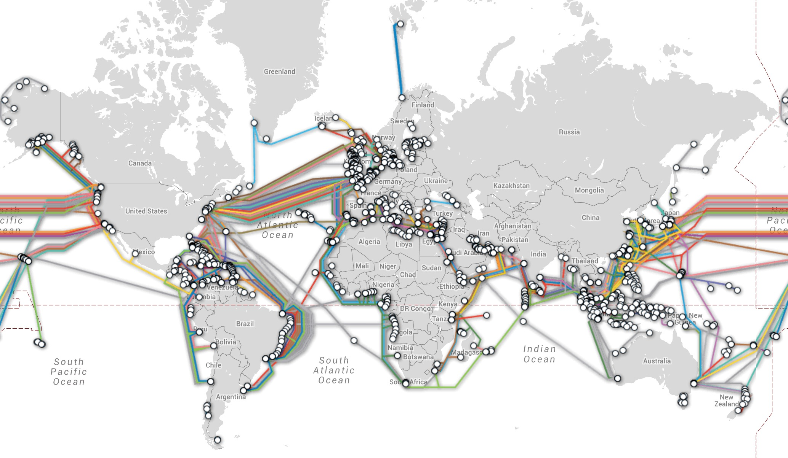

# The INTERWEBS #

"A series of tubes" — [Senator Ted Stevens (R-Alaska)](https://en.wikipedia.org/wiki/Series_of_tubes)

Okay... but tubes?

Well technically perhaps you can think of electrical and optical lines as tubes, but regardless before we can code for the web we should understand what all is involved.

Here is map of the submarine optical cables that provide internet connectivity globally. Note: most internet runs over physical cables, satellite is used only for remote areas and has a very high latency.


(from [submarinecablemap.com](http://www.submarinecablemap.com/))


(from [Chris Harrison](http://chrisharrison.net/index.php/Visualizations/InternetMap))


(from [Paul Butler](https://gigaom.com/2010/12/14/facebook-draws-a-map-of-the-connected-world/))
This FB map is more of a social graph but does show internet connected facebook users. Notice anything interesting missing?


## Layers ##

The internet is made of layers. Like parfait.

Let's use a better example.

When you need to get from point A to point B first thing you need are addresses.  Currently internet addresses look like **nnn.nnn.nnn.nnn**.   Each triplet indicates something about the address.


When data needs to get from point A to point B on the internet .  This passenger is carrying data and is called a **packet**.


(image from [Computer Networking: A Top Down Approach])


(image from [Computer Networking: A Top Down Approach](https://wps.pearsoned.com/ecs_kurose_compnetw_6/))


## Packets ##

All internet connected devices communicate using packets of data.


Lets play out a scenario.

If you don't read Hacker News, you should. So lets pull up a hacker news page.


## Loading a page: the play ##


_Human:_

 > Hey *Browser*, go to http://news.ycombinator.com

_Browser:_

 > Hold on, I don't know how to get there.

*Browser:*

 > Hey *Computer*,  what is the address for news.ycombinator.com?
 `host news.ycombinator.com`

*Computer:*

 > Hmm, one sec.

*Computer:*

 > Hey *ISP DNS server*, what's the addy for news.ycombinator.com?

*ISP DNS Server:*

 > No idea, better ask someone more knowledge like the *ROOT DNS Servers*.

*Computer:*

 > Hey *ROOT DNS Servers* whois responsible for ycombinator.com?
 `whois ycombinator.com`

*ROOT DNS Servers:*

 > Better ask the *.COM DNS Servers*, they should know more.

*Computer:*

 > Hey *.COM DNS Servers*, what's the addy for news.ycombinator.com?

*.COM DNS Servers:*

 > Oh, that was registered to Nicholas Sivo in 2005 and here's a list of *Hosts DNS Servers* that will know all about it.

*Computer:*

 > Ok now we're getting somewhere.
 > Hey *Hosts DNS Servers* what is the IP address for news.ycombinator.com.

*Hosts DNS Servers:*

 > Sure thing boss, here it is: *198.41.191.47*

*Computer hands address to Browser. Browser nods and gets back to work.*

*Browser:*

 > Hey *198.41.191.47*, I want to make a GET HTTP request. Give me / from the default http port for 80.

*198.41.191.47:*

 > Oooh, I'm just the load balancer, let me forward that request to one of my *Webservers*.

*198.41.191.47:*

 > Hey, *Webserver*, here's a request for you.

*Webserver:*

 > Ok, I have a *process* running on port 80 that should be able to answer that, please hold.

*Process:*

 > Lets, see, I need a list of today's top stories to answer that, one sec while I ask one of my *Database Servers*.

*Process:*

 > Hey *Database Server*: 'select title,description from stories order by date desc limit 10'    

*Database Server:*

 > Ok, ok.  Here you go: [results]

*Process takes results,  makes some pretty html for each row in the results and hands it to the webserver.*

*Webserver takes the html and responds to the waiting Browser.*

*Browser:*

 > Oh wow thanks. Ok I'll draw that on the screen! I think I know what all html should look like.


## Routing ##

Wait but there can't be tubes connecting all those machines can there?

Correct we've left out how one machine actually calls up another.


```
if ( N matches a directly connected network address )

    Deliver datagram to D over that network link;

else if ( The routing table contains a route for N )

    Send datagram to the next-hop address listed in the routing table;

else if ( There exists a default route )

    Send datagram to the default route;

else

    Send a forwarding error message to the originator;
```
(from [wikipedia](https://en.wikipedia.org/wiki/IP_forwarding))
